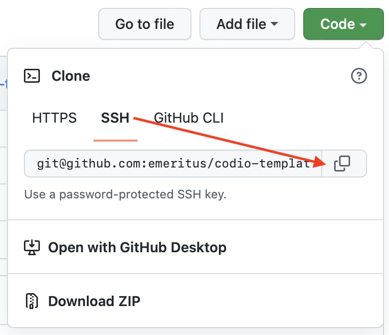
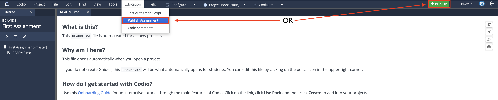

# codio-template

Important information about this course:

- Course Code: TEST-CT1 <!-- REPLCE THIS CODE WITH YOUR COURSE CODE-->
- [Codio Parent (Master) Course](https://codio.com/home/teacher/8d6222df046f7220a9d96ac47ec84da8/overview) <!-- REPLACE THIS LINK WITH LINK TO CODIO MASTER COURSE WHEN CREATED -->
- [Canvas Master Course](https://www.google.com) <!-- REPLACE THIS LINK WITH LINK TO CANVAS MASTER COURSE WHEN CREATED -->

This readme contains information for setting up and developing a new repo for a course which utilizes Codio. It also includes an action that uploads assignments to AWS.

## Initial Codio Connection Setup

The `codio-publish` action requires a course in Codio to publish to. This should be the parent (master) course which is connected via LTI to the Canvas master. 

To request that this course be created in Codio, contact rohini.as@emeritus.org with the name of the course.
<!---->
**The name should be** "COURSE-CODE-Master". Then, in the file `.github/workflows/publish.yaml`, you should update the `course-name` parameter to be the name of the new course (which, again, should be COURSE-CODE-Master).
  

Now, the publish action should be connected to the course in Codio. Once this is done successfully, **paste the URL to this Codio parent (master) course into the link on line 6 of this README** so that it can be found quickly in the future. Furthermore, once this Codio parent (master) course is connected to the Canvas master course via LTI, you should then remember to paste the URL to the Canvas master into the corresponding place on line 7 of this README. Also make sure to update the course code from TEST-CT1 to the code for this course.

## Creating a New Codio Project to Develop From
  
The assignments for this course should be developed from within a separate personal project in Codio. You will use this Codio project to develop the assignments for the course, and to push these developments to this repository, which will publish the assignments to Codio and upload them to AWS.

You may wish to develop assignments locally. At this time, this is not an available option. Becuase the students will run the assignments in Codio using a specific OS and environment, all assignments need to be compatible with this configuration. The easiest way to ensure this is to develop the assignments within the same configuration: on Codio, using the same Stack. When we experimented with local development, there were too many versioning and compatibility issues to make it a viable workflow. This is why we use a Codio project to develop from.

**In order to connect the new project to this repo, your Codio account must first be configured with your GitHub account.** For steps on how to do this, see [this guide](to-do).

To start, create a new Codio Project:

Under starting point, select "click here" to see more options:

Choose Import. The stack you choose for this project should be the same one you will use for the course assignments. This may be one of our base stacks, which you can later update and add libraries to create the new stack for this course. For more information on how to choose and manage the stack, see [this guide](to-do).

Using a Git source, paste the GitHub SSH Clone URL (**NOT** the HTTPS URL) from this repository:

This URL can be found on the GitHub page for this repo:

The name of this project is inconsequential as the project is only in your personal Codio account, but is is suggested that you use "COURSE-CODE-Development" to keep things straight. Your Gigabox choice will probably be standard, see [this guide](to-do) if you think it may be otherwise.

After choosing "Create", you should have a new project in your Codio account to develop the course from. This is basially just a remote machine that you are using to develop. Thus, all Git operations can be performed from this remote shell using the terminal, which you can open from the toolbar:

For example, try running `git status` to make sure everything is setup and connected properly. You can now commit and push changes directly from this project. **For more information on how to develop assignments for Emeritus, see [this guide](todo) which contains templates and standard practices.**

## Adding and Connecting a New Assignment

Assignments can be pushed from the github project to the repo and then automatically published to the parent (master) Codio course. To do this, the codio-publish action needs to know what files to publish and what assignment to publish to in the master course. This connection is specified in the file `.github/yaml_map/yaml_maps.yaml`. Until an assignment is actually added to the yaml map, it will not be automatically published. Once this is done, however, it will be published on every push to the main branch.

To create a newly connected assignment, open the parent (master) course in Codio and create a new empty assignment:

The stack for this assignment should be the same one that you are using in the Codio project you are developing in. The name should be the name as you want it to appear to the students, and **must be unique within the course[^names]**. You will need this name to update the yaml map.

Upon clicking "Create", you should be taken to the new assignment. In order to be saved and available for remote publishing, **the assignment must be initially published**. To do this, just click the green "Publish" button in the top right of the assignment editor, or from the "Education" dropdown in the toolbar:

Now that the assignment is published, you can update the yaml map to point your desired files to it. Within `.github/yaml_map/yaml_maps.yaml`, you should make a new entry (after a new line of separation from any existing entries) in the form:

The `assignmentName` should be the name that you chose for the assignment in the parent (master) Codio course. (Replace "First Asssignment" in this example). The `source` should be the path to the folder you have the assignment starter code in.

Upon adding this new entry to the yaml map, the codio-publish action will automatically publish the contents of this folder to the specified assignment in the master course on any push to main (Note that live child courses in Codio will not be updated automatically; the changes will need to be pulled. For more information, see [this guide](to-do)).

## Other Useful Information

### AWS Upload Action for Starer and Solution Files

This action will zip and upload assignment contents to aws, and provide the download links for use in Canvas. The action yaml file is `.github/workflows/aws-upload-for-canvas.yaml` if you wish to see the actual code. 

Specifically, when a commit is pushed to `main`, the action will search for any directories which contain the word 'starter' or 'solution'. For each of these folders, the contents inside will be zipped and uploaded to AWS. The links to these uploaded zips are then recorded into the file `.github/aws-upload-report.md`.

Realize that file names in the repository **must not contain spaces**. This is a known issue with this script, and will cause the job to fail.

The upload link created for each folder contains only the highest and lowest directory names in the file path. For example, the link to the file in a folder `assignments/module1/nameone/starter/` will be `...assignments/nameone_starter.zip`. This means that another starter folder located at `assignments/module2/nameone/starter/` will have *the same link*, and will thererfore overwrite the prior when uploading. This is important because it means that the nesting folder of each starter and solution file (the assignment name) **must be unique for all assignments in the repo**. This template repository contains an example suggested organization of the assignment file structure you can use.

The script utilizes four repository secrets for AWS credentials which have been set as Emeritus organization secrets in GitHub.

### Requirements

Once you have created the stack for this course, it is suggested that you create and commit a `requirements.txt` file containing the libraries in the stack. For example, if you are using Python, `pip freeze > requirements.txt` will create such a file. This is not entirely necessary, but may help to keep things straght and can make it easier to run the assignments locally if necessary. Make sure to keep the file up to date with the stack.

[^names]: It is possible to have assignments of the same name *in the Codio course*, but in this case, the assignment-id must be specified in the yaml map rather than the name. See [this guide](to-do) for more information.
